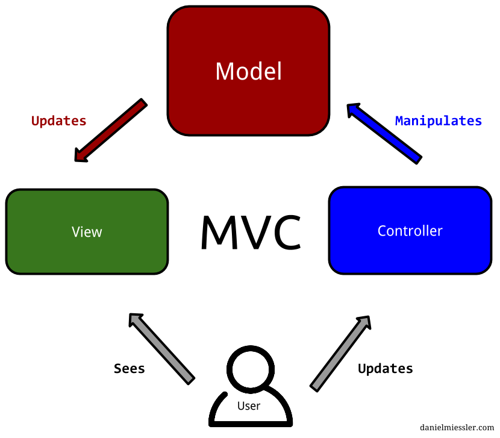

# 设计模式

[《设计模式之禅》六个设计原则](https://blog.csdn.net/qq_24634505/article/details/80776964)

[《设计模式之禅》23中设计模式](https://blog.csdn.net/ls0111/article/details/80277950)

#### **设计模式分类**

* 创造类：用于创建对象的模式
* 行为类：适用于特定行为场景的模式
* 结构类：描述对象间组织结构的模式

### **单例模式**

 构造函数私有化，避免被其他函数调用。客户端通过getInstance的方式调用。

**优点**：避免对资源的多重占用，节约内存，可以设置全局访问点，优化共享资源访问。

**缺点**：扩展困难，可能与单一职责原则有冲突。 

**使用场景**:要求对象必须唯一；整个项目需要一个共享访问点；创造对象消耗很多资源；需要定义大量静态常量和方法（也可以直接声明为static） 

**注意事项**：在高并发情况下应当注意单例模式的线程同步问题。如线程a和b同时执行，都判断到singleton==null，会使线程中同时存在多个对象。

**c++实现**：

```cpp
Singleton* getInstance()
{
    if (instance == NULL)
        instance = new Singleton();   //构造函数私有化，对外提供getInstance接口

    return instance;
}
```

\*\*\*\*

### **Bridge模式\(接口与实现分离\)**

①C++中的接口一般设计为不包含成员变量的抽象类，如果接口类中包含了成员变量，接口与实现就混合在了一起，会给派生带来麻烦（不管愿不愿意，子类必须接受父类的成员变量）。②声明一个和实现类接口完全相同的类，这样用指针引用该类的时候客户端不用重新编译，直接替换dll就行

**方法**：父类声明为只包含接口的抽象类，子类继承父类接口，并增加自己的接口，再用实现类继承子类，去实现子类接口

**优点**：抽象和实现之间不绑定，可以快速切换实现部分，不用把实现类细节提供给客户，修改实现部分时对客户端也无需重编译，不受影响。

**缺点**：每个实现类都要实现一遍接口的成员函数，比较繁琐。

**使用场景**： 隐藏抽象时间、共享实现或引用计数。

**实现**：

```cpp
//1 接口继承
class Shape {   // pure interface
public:
    virtual Point center() const = 0;
    virtual Color color() const = 0;
 
    virtual void rotate(int) = 0;
    virtual void move(Point p) = 0;
    // ...
};
 
class Circle : public Shape {   // pure interface
public:
    int radius() = 0;
    // ...
};

//2 实现
//实现放到了Impl这个名称空间中,这样使用Shape的客户端代码就不会随着Impl中Shape类的成员变量的变化
//而重新编译，因为客户端代码是看不到这些内容的，编译的时候也没有绑定这些信息。

class Impl::Shape : public Shape { // implementation
public:
    // constructors, destructor
    // ...
    virtual Point center() const { /* ... */ }
    virtual Color color() const { /* ... */ }
 
    virtual void rotate(int) { /* ... */ }
    virtual void move(Point p) { /* ... */ } 
    // ...
}

//3 考虑新增派生类的写法：
class Smiley : public Circle { // pure interface
public:
    // ...
};

class Impl::Smiley : Public Smiley, public Impl::Circle {   // implementation
public:
    // constructors, destructor
    // ...

//派生路线
Smiley     ->         Circle     ->  Shape
  ^                    ^               ^
  |                    |               |
Impl::Smiley -> Impl::Circle -> Impl::Shape
```

### **工厂模式**

**优点**： 1、只需知道名称就可以创建一个对象

2、扩展性高，增加产品时只需增加一个工厂类 

 **使用场景**：不同条件下创建不同实例 

 **实现**：

```java
//简单工厂模式

public class ShapeFactory {
    
   //使用 getShape 方法获取形状类型的对象
   public Shape getShape(String shapeType){
      if(shapeType == null){
         return null;
      }        
      if(shapeType.equalsIgnoreCase("CIRCLE")){
         return new Circle();
      } else if(shapeType.equalsIgnoreCase("RECTANGLE")){
         return new Rectangle();
      } else if(shapeType.equalsIgnoreCase("SQUARE")){
         return new Square();
      }
      return null;
   }
}

//工厂方法
//和简单工厂的一些区别就是 不需要使用字符串来判断创建类型，避免传入字符串不对导致无法创建对象
//                     使用static，不用创建工厂对象

class SenderFactory {
    public static Sender produceEmail() {
        return new EmailSender();
    }

    public static Sender produceSMS() {
        return new SMSSender();
    }
}
```

### 

### **命令模式**


#### **实现：**

```cpp
  //命令调用类
 public class Broker {
   private List<Order> orderList = new ArrayList<Order>(); 
 
   public void takeOrder(Order order){         //接受命令
      orderList.add(order);      
   }
 
   public void placeOrders(){               //执行命令
      for (Order order : orderList) {
         order.execute();
      }
      orderList.clear();
   }
}
```

### **代理模式**

**适用场景**：解决接访问对象时出现的问题，如，要访问的对象在远程机器上、创建开销很大、需要安全控制等，直接访问给使用者或系统结构带来麻烦时，在对象上加上一个对此对象的访问层（中介）

**优点**：职责清晰，高扩展性

**注意事项：** 1、和适配器模式的区别：适配器模式主要改变所考虑对象的接口，而代理模式不能改变所代理类的接口。 2、和装饰器模式的区别：装饰器模式为了增强功能，而代理模式是为了加以控制。

**实例**：猪八戒去找高翠兰结果是孙悟空变的，可以这样理解：把高翠兰的外貌抽象出来，高翠兰本人和孙悟空都实现了这个接口，猪八戒访问高翠兰的时候看不出来这个是孙悟空，所以说孙悟空是高翠兰代理类

```java
//需要代理实现display方法
public interface Image {
   void display();
}
//被代理的实体要继承接口，实现这个display方法
public class RealImage implements Image {
 
   private String fileName;
 
   public RealImage(String fileName){
      this.fileName = fileName;
      loadFromDisk(fileName);
   }
 
   @Override
   public void display() {
      System.out.println("Displaying " + fileName);
   }
 
   private void loadFromDisk(String fileName){
      System.out.println("Loading " + fileName);
   }
}

//代理类继承接口，管理实体类对象，调用实体类对象的方法
public class ProxyImage implements Image{
 
   private RealImage realImage;
  
   @Override
   public void display() {
      if(realImage == null){
         realImage = new RealImage(fileName);
      }
      realImage.display();
   }
}

//调用
public class ProxyPatternDemo {
   
   public static void main(String[] args) {
      Image image = new ProxyImage("test_10mb.jpg");
 
      // 图像将从磁盘加载
      image.display(); 
      System.out.println("");
      // 图像不需要从磁盘加载
      image.display();  
   }
}
```

### 适配器模式

将一个类的接口转换成客户希望的另外一个接口，使得原本由于接口不兼容而不能一起工作的那些类可以一起工作。

**缺点**：让系统凌乱，如果不是很有必要，可以不使用适配器，而是直接对系统进行重构

### 装饰器模式

### 建造者模式

### **享元模式**

\*\*\*\*

### 迭代器模式

迭代器模式就是分离了集合对象的遍历行为，抽象出一个迭代器类来负责，这样既可以做到不暴露集合的内部结构，又可让外部代码透明地访问集合内部的数据。

```cpp
void RenderTree::ForEach(std::function<void(RenderNode * const)> func)
	{
		for (auto & node : _renderNode)
		{
			func(node.second.get());
		}
	}
 //forEach函数定义↑，调用↓
 std::function<void(StaticRenderer::RenderNode* const)> func = [&](StaticRenderer::RenderNode* const node) {
		::glLoadName(node->GetID());
		ModelManager::DrawAABB(node, viewMat, newproject);
	};
	StaticRenderer::RenderTree::GetInstance()->ForEach(func);
```


### 观察者模式


**优点**：观察者和抽象者不直接耦合

**注意**：观察者和被观察者不能循环依赖！


### MVC 模式

MVC 模式代表 Model-View-Controller（模型-视图-控制器） 模式。这种模式用于应用程序的分层开发。

* **Model（模型）** - 模型代表一个存取数据的对象。它也可以带有逻辑，在数据变化时更新控制器。
* **View（视图）** - 视图代表模型包含的数据的可视化。
* **Controller（控制器）** - 控制器作用于模型和视图上。它控制数据流向模型对象，并在数据变化时更新视图。它使视图与模型分离开。




**实现**：

```cpp
//model 类
public class Student {
   private String name;

   public String getName() {
      return name;
   }
   public void setName(String name) {
      this.name = name;
   }
}

//view 类
public class StudentView {
   public void printStudentDetails(String studentName, String studentRollNo){
      System.out.println("Student: ");
      System.out.println("Name: " + studentName);
   }
}

//controller类
public class StudentController {
   private Student model;
   private StudentView view;
 
   public StudentController(Student model, StudentView view){
      this.model = model;
      this.view = view;
   }
 
   public void setStudentName(String name){   //user通过controller控制model类
      model.setName(name);    
   }
 
   public String getStudentName(){      //user通过controller控制model类
      return model.getName();    
   }

   public void updateView(){           
      view.printStudentDetails(model.getName(), model.getRollNo());
   }  
}
```

### **游戏循环**


**参考资料**：

* [http://www.runoob.com/design-pattern/design-pattern-tutorial.html](http://www.runoob.com/design-pattern/design-pattern-tutorial.html) RUNOOB设计模式教程
* 秦小波《设计模式之禅》
* [https://blog.csdn.net/fly542/article/details/6720217](https://blog.csdn.net/fly542/article/details/6720217) 设计模式----Bridge模式
* [https://blog.csdn.net/calmreason/article/details/53534766 ](https://blog.csdn.net/calmreason/article/details/53534766%20)C++设计：接口与实现分离
* 自己的游戏设计模式 xmind笔记
* 自己的ECS架构笔记

